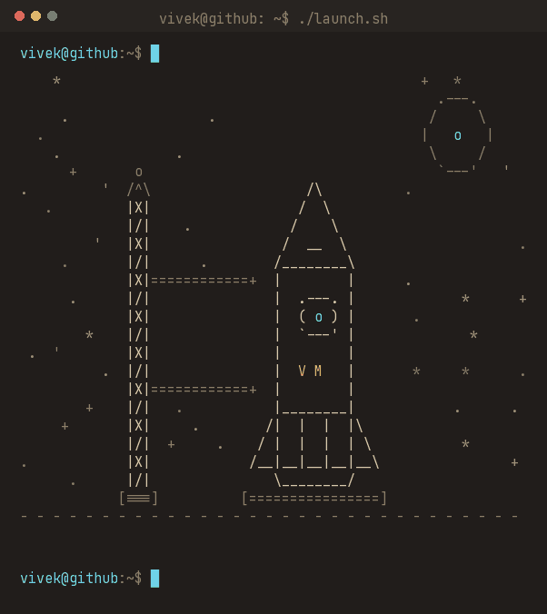
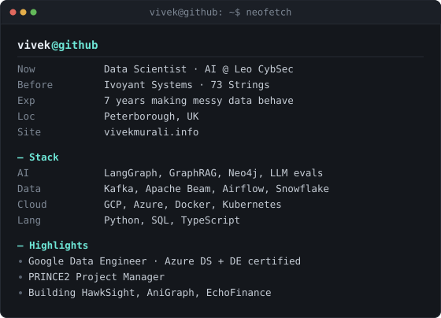
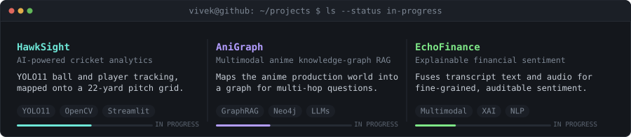
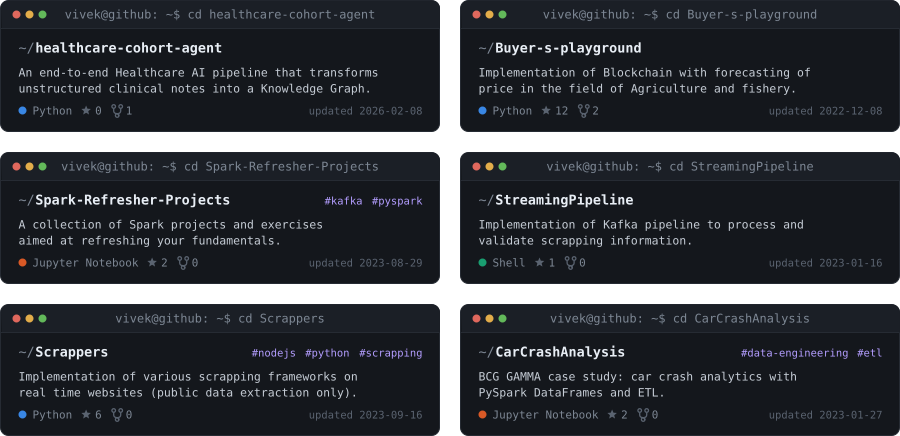
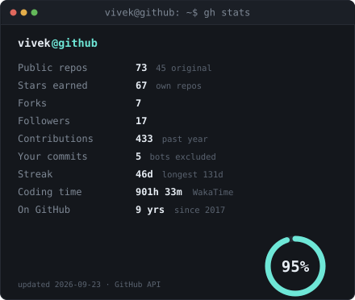
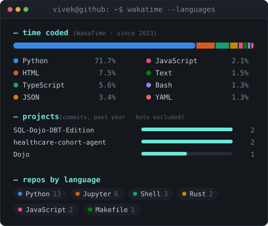

<div align="center">

<table>
<tr>
<td width="37%"></td>
<td width="63%"></td>
</tr>
</table>

<h2>Vivek Murali</h2>
<p><b>AI · Data Science · Data Engineering</b> — <i>I make messy data behave.</i></p>

<p><a href="https://www.vivekmurali.info/"></a> <a href="https://www.linkedin.com/in/vivek-murali-482112a4/"></a> <a href="https://twitter.com/Jet_Vivek"></a> <a href="https://www.buymeacoffee.com/vivekmurali"></a></p>
<p>  </p>

</div>

---

### ▶ Now building



### ▶ Featured projects



### ▶ GitHub stats & favourite languages

<p align="center">


</p>

<details>
<summary>▶ Full WakaTime breakdown</summary>

<!--START_SECTION:waka-->

```rust
From: 14 January 2023 - To: 16 September 2026

Total Time: 901 hrs 6 mins

Python                     648 hrs 44 mins >>>>>>>>>>>>>>>>>>-------   71.74 %
HTML                       68 hrs 14 mins  >>-----------------------   07.55 %
TypeScript                 50 hrs 50 mins  >------------------------   05.62 %
JSON                       30 hrs 32 mins  >------------------------   03.38 %
JavaScript                 18 hrs 34 mins  >------------------------   02.05 %
Text                       13 hrs 43 mins  -------------------------   01.52 %
Bash                       11 hrs 52 mins  -------------------------   01.31 %
YAML                       11 hrs 42 mins  -------------------------   01.29 %
Markdown                   11 hrs 4 mins   -------------------------   01.22 %
Docker                     9 hrs 44 mins   -------------------------   01.08 %
```

<!--END_SECTION:waka-->

</details>

---

<div align="center">

<!--STARTS_HERE_QUOTE_README-->
• <i>“Knowledge is power”— Francis Bacon</i>
<!--ENDS_HERE_QUOTE_README-->

</div>
